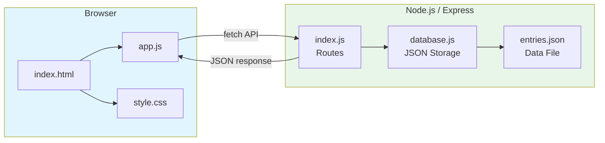

# Guestbook Application

> IBM Full-Stack JavaScript Developer Certificate

[](LICENSE)
[](Dockerfile)
[](https://nodejs.org)

[English](#english) | [Portugues](#portugues)

---

## English

### Overview

**Guestbook Application** is a full-stack web application built with Node.js and Express. Visitors can sign the guestbook by posting messages, view all entries in reverse chronological order, and delete individual messages. Data is persisted using a JSON file-based storage system.

### Key Features

- **REST API**: CRUD endpoints for guestbook entries (GET, POST, DELETE)
- **JSON Storage**: File-based persistence without requiring a database
- **Responsive Frontend**: Clean, modern UI with vanilla HTML, CSS, and JavaScript
- **Real-time Feedback**: Status messages, relative timestamps, and smooth interactions
- **Input Validation**: Server-side and client-side validation for all inputs

### Architecture



### Quick Start

```bash
git clone https://github.com/galafis/ibm-js-fullstack-guestbook-app.git
cd ibm-js-fullstack-guestbook-app
npm install
npm start
```

Then open http://localhost:3000

### API Endpoints

| Method | Endpoint           | Description           |
|--------|-------------------|-----------------------|
| GET    | /api/entries      | List all entries      |
| POST   | /api/entries      | Create new entry      |
| DELETE | /api/entries/:id  | Delete entry by ID    |
| GET    | /api/stats        | Get entry count       |

### Project Structure

```
ibm-js-fullstack-guestbook-app/
├── server/
│   ├── index.js          # Express server and routes
│   └── database.js       # JSON file storage
├── public/
│   ├── index.html        # Frontend HTML
│   ├── style.css         # Styles
│   └── app.js            # Frontend JavaScript
├── package.json
└── README.md
```

### Tech Stack

| Technology  | Role              |
|------------|-------------------|
| Node.js    | Runtime           |
| Express    | Web framework     |
| HTML/CSS   | Frontend markup   |
| JavaScript | Client logic      |

### License

This project is licensed under the MIT License - see the [LICENSE](LICENSE) file for details.

### Author

**Gabriel Demetrios Lafis**
- GitHub: [@galafis](https://github.com/galafis)
- LinkedIn: [Gabriel Demetrios Lafis](https://linkedin.com/in/gabriel-demetrios-lafis)

---

## Portugues

### Visao Geral

**Guestbook Application** e uma aplicacao web full-stack construida com Node.js e Express. Visitantes podem assinar o livro de visitas postando mensagens, visualizar todas as entradas em ordem cronologica reversa e deletar mensagens individuais. Os dados sao persistidos usando um sistema de armazenamento baseado em arquivo JSON.

### Funcionalidades Principais

- **API REST**: Endpoints CRUD para entradas do livro de visitas (GET, POST, DELETE)
- **Armazenamento JSON**: Persistencia baseada em arquivo sem necessidade de banco de dados
- **Frontend Responsivo**: Interface limpa e moderna com HTML, CSS e JavaScript puros
- **Feedback em Tempo Real**: Mensagens de status, timestamps relativos e interacoes suaves
- **Validacao de Entrada**: Validacao no servidor e no cliente para todos os inputs

### Inicio Rapido

```bash
git clone https://github.com/galafis/ibm-js-fullstack-guestbook-app.git
cd ibm-js-fullstack-guestbook-app
npm install
npm start
```

Depois abra http://localhost:3000

### Licenca

Este projeto esta licenciado sob a Licenca MIT - veja o arquivo [LICENSE](LICENSE) para detalhes.

### Autor

**Gabriel Demetrios Lafis**
- GitHub: [@galafis](https://github.com/galafis)
- LinkedIn: [Gabriel Demetrios Lafis](https://linkedin.com/in/gabriel-demetrios-lafis)
